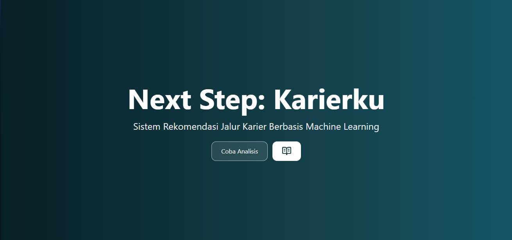

# Next Step: Karierku

## Deskripsi Proyek

**Next Step: Karierku** adalah sistem analisis karier berbasis model machine learning yang dirancang untuk membantu pengguna memahami kecenderungan karier yang paling relevan dengan profil mereka. Sistem ini mengklasifikasikan profil pengguna ke dalam kelompok **role pekerjaan utama** berdasarkan deskripsi persona dan kumpulan keterampilan (skills) yang dimiliki.

Pengguna memasukkan narasi singkat tentang latar belakang, minat, dan pengalaman, serta daftar keterampilan yang dikuasai. Sistem kemudian memproses informasi tersebut menggunakan pendekatan data-driven untuk memetakan kecocokan dengan role pekerjaan yang paling sesuai.

#### Coba aplikasinya di sini: [Demo Next Step: Karierku](https://demo-frontend-chi-eight.vercel.app)

---

## Tujuan

- Membantu pengguna mengenali potensi dan arah karier yang relevan
- Memberikan rekomendasi role pekerjaan dan skill gap berbasis analisis data
- Menjadi alat bantu eksplorasi karier yang objektif dan terstruktur

---

## Contoh Alur Penggunaan

1. Pengguna mengisi deskripsi persona (background, minat, pengalaman, juga skill yang dimiliki).
2. Sistem melakukan analisis data.
3. Sistem menampilkan hasil klasifikasi dan rekomendasi role pekerjaan.

---

## Teknologi

- Frontend: React
- Backend: FastAPI
- Machine Learning / Data Processing: Python (numpy, pandas, scikit-learn, NLP, dll.)

---

## Penutup

**Next Step: Karierku** diharapkan dapat menjadi langkah awal bagi pengguna dalam menentukan arah karier yang lebih terarah dan berbasis data.
